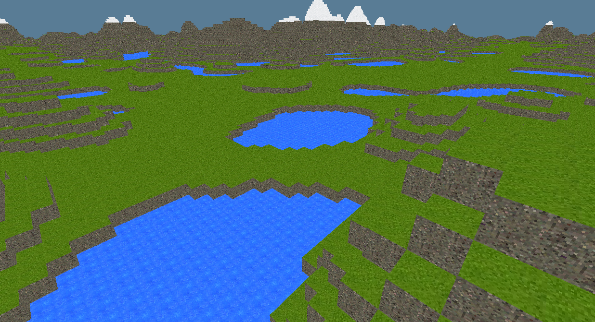

# 3d_experiments

    

This code is not organized, safe, idiomatic, efficient, or bug-free. However, it serves as a nice experimentation bed for 3D rendering with wgpu-rs. At the time of writing this, the feature set of this program is as follows:

- Render 100*100 cuboid columns in a grid, with the pillars' respective heights being a function of simplex noise. This process vaguely resembles voxel based procedural terrain generation algorithms.
- The amplitude of the simplex noise can be increased by pressing `J`.
- The sampling frequency of the simplex noise can be increased by pressing `L`.

The shaders used by the program are included in both `GLSL` and binary (`SPIR-V`) formats. These shaders can be compiled manually using `make` (`glslangValidator` must be in `$PATH`).

Only Windows is known to work, though the code should be fully adaptable to other operating systems.
